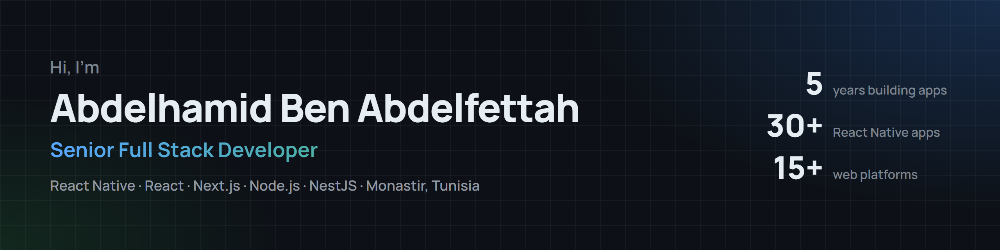
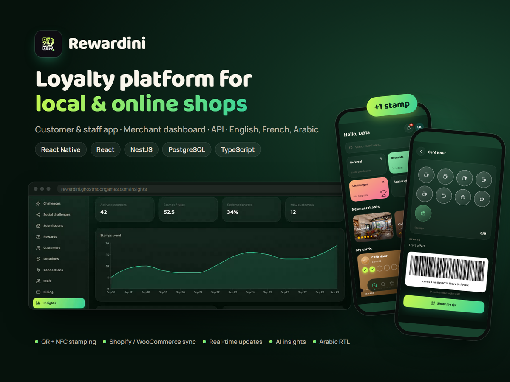
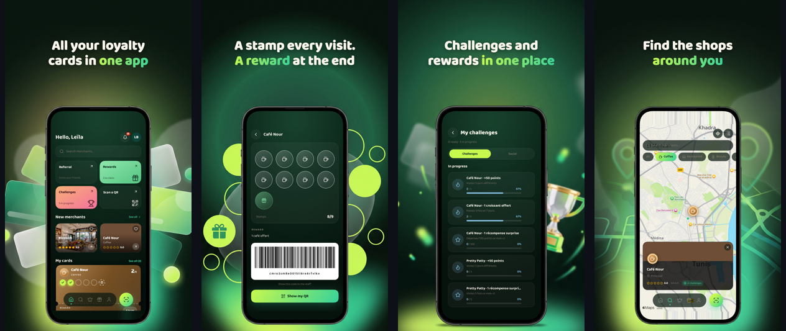

  

  
  
  

## About me

I'm a Senior Full Stack Developer and Software Engineer with 5 years of experience building mobile and web applications, with a focus on **React Native**. I've delivered **30+ React Native apps** and **15+ web platforms** with React, Next.js, Node.js and NestJS, on MongoDB and PostgreSQL.

I also work as a technical project manager: I take projects from client requirements and estimates through planning and delivery. I hold an Engineering Degree in Software Engineering (Excellent), with hands-on work in AI and natural language processing.

## Tech stack

  

| Area | Technologies |
| --- | --- |
| Mobile | React Native, Android, iOS |
| Front-end | React, Next.js, Vue.js, Angular, TypeScript, JavaScript, HTML, CSS |
| Back-end | Node.js, NestJS, Express, PHP, Symfony, Java, Spring Boot, Python, Flask |
| Databases | PostgreSQL, MongoDB, MySQL, Oracle, Redis |
| AI & data | Machine learning, deep learning, NLP, TensorFlow |
| DevOps | Docker |
| Project management | Requirements analysis, planning and estimation, team coordination, client communication |

## Featured project: Rewardini

  

**A multi-tenant SaaS loyalty platform for local and online shops.** Customers keep every shop's card in one app and show one QR at the counter. Merchants run stamp cards, points, rewards, challenges and VIP cards from a web dashboard.

- **Mobile app** (React Native): QR and NFC stamping, a QR that works offline, a map of nearby shops, push notifications
- **Merchant portal and admin dashboard** (React 19, TypeScript, TanStack Query, Tailwind CSS): insights with AI suggestions, multiple locations, team roles, Paddle subscription billing
- **API** (NestJS, Prisma, PostgreSQL, Redis, Docker): REST and WebSocket, real-time stamp updates, Shopify and WooCommerce coupon sync
- English, French and Arabic, with full right-to-left support

  

<a href="https://rewardini.ghostmoongames.com">rewardini.ghostmoongames.com</a>

## Selected projects

| | Project | Stack | What it does |
| :---: | --- | --- | --- |
|  | **Rewardini** | React 19, TypeScript, React Native, NestJS, Prisma, PostgreSQL, Redis, Docker | Multi-tenant SaaS loyalty platform with QR/NFC digital stamp cards, a merchant portal, an admin dashboard and a mobile app |
|  | **Guidini** | React Native, NestJS, PostgreSQL | Tracking and communication app for travel agencies, tour guides and their groups |
|  | **Trustini** | Next.js, NestJS, PostgreSQL | Helps e-commerce merchants check customer reliability through real order history shared by the community |
|  | **Switchini** | Next.js, React Native, NestJS, Prisma, PostgreSQL, Redis, Docker | Platform for exchanging and donating unused goods within the community |
| | **Wood Transfer Digitisation** (freelance) | React Native, Odoo | 10 mobile apps for an international wood company, replacing its wood-transfer paperwork |
| | **RFID Student Attendance** (IoT) | Arduino, Angular, Node.js, MongoDB | Automatic student attendance tracking with RFID tags |

## Experience

**Senior Full Stack Developer (React Native focus)**, OpenEyesConsulting, Teboulba, Tunisia · *Aug 2021 – Aug 2026*
- Delivered 30+ production iOS and Android apps in fintech, healthcare, booking, e-commerce, transport, social media and parental control
- Delivered 15+ web applications, including ERP and SaaS platforms, an AI-driven contract manager, and booking, healthcare, e-commerce and aviation solutions
- Led projects end to end as technical project manager, and was the main point of contact for clients from scoping to delivery

**Earlier:** final-year engineering internship building an AI model for automatic source code generation (Python, TensorFlow, Flask) · remote internship at AllianTech, Paris, building an NLP application for sensor data sheets

## Education

- **Engineering Degree in Software Engineering** (Excellent), ISSAT Sousse · 2018 – 2021
- **Bachelor's Degree in Computer Science** (Excellent), ISIMA Mahdia · 2014 – 2017

---

Open to freelance and full-time roles in mobile and full-stack development. <a href="mailto:benabdelfettah.abdelhamid@gmail.com">Get in touch</a>.

