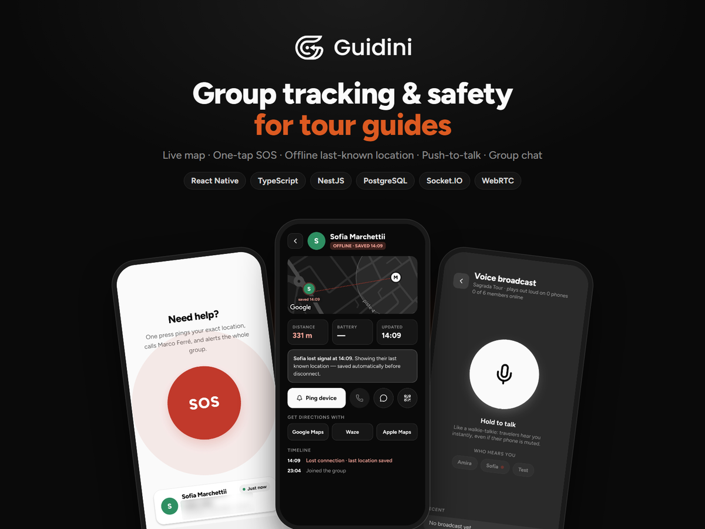
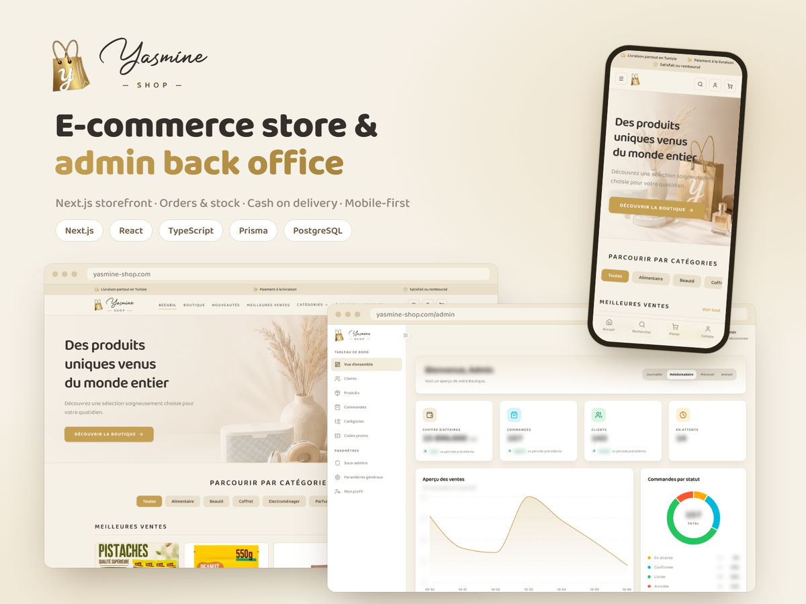
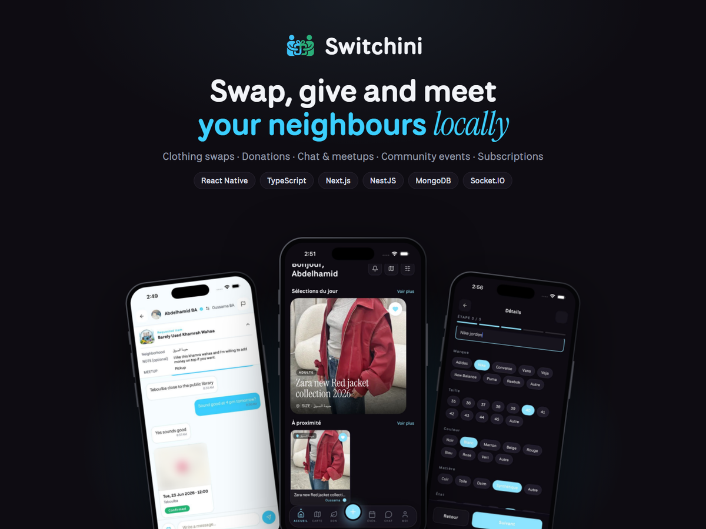

  

  
  
  

## About me

I'm a Tech Lead and Senior Full Stack Developer with 5 years of experience leading the delivery of mobile and web products, with a focus on **React Native**.

I lead projects end to end: from client requirements, architecture and planning through to delivery, coordinating developers and acting as the main technical contact for clients. I've shipped **30+ React Native apps** and **15+ web platforms** with React, Next.js, Vue.js, Node.js and NestJS on PostgreSQL, MongoDB and Redis, including multi-tenant SaaS products.

I hold an Engineering Degree in Software Engineering (Excellent), with hands-on work in AI and natural language processing.

## Tech stack

  

| Area | Technologies |
| --- | --- |
| Leadership | Technical leadership, software architecture, requirements analysis, planning and estimation, team coordination, client communication |
| Mobile | React Native, Android, iOS |
| Front-end | React, Next.js, Vue.js, Angular, TypeScript, JavaScript, HTML, CSS |
| Back-end | Node.js, NestJS, Express, PHP, Symfony, Java, Spring Boot, Python, Flask |
| Databases | PostgreSQL, MongoDB, MySQL, Oracle, Redis |
| AI & data | Machine learning, deep learning, NLP, TensorFlow |
| DevOps | Docker |

## Featured project: Rewardini

  

**A multi-tenant SaaS loyalty platform with QR/NFC digital stamp cards.** Customers keep every shop's card in one app and show one QR at the counter. Merchants run stamp cards, points, rewards, challenges and VIP cards from a web portal.

- **Mobile app** (React Native): QR and NFC stamping, a QR that works offline, a map of nearby shops, push notifications
- **Merchant portal and admin dashboard** (React 19, TypeScript, TanStack Query, Tailwind CSS): AI-generated insights, multiple locations, team roles, Paddle subscription billing
- **API** (NestJS, Prisma, PostgreSQL, Redis, Docker): REST and WebSocket, real-time stamp updates, Shopify and WooCommerce coupon sync
- Trilingual: French, English and Arabic, with full right-to-left support

  

<a href="https://rewardini.ghostmoongames.com">rewardini.ghostmoongames.com</a>

## More featured projects

<table>
  <tr>
    <td width="50%" valign="top">
      
      <h3>Guidini</h3>
      
Group tracking and safety app for tour guides. The guide sees every traveler live on a shared map, gets an alert when someone strays, and talks to the whole group push-to-talk. One SOS button pings the traveler's location, calls the guide and alerts the group, and the last known location stays visible when a phone loses signal.

      
React Native · TypeScript · Redux-Saga · Socket.IO · WebRTC · Firebase · NestJS · PostgreSQL

    </td>
    <td width="50%" valign="top">
      
      <h3>YasmineShop</h3>
      
Live e-commerce store for a Tunisian retailer, with 400+ products and cash on delivery across Tunisia. A Next.js storefront (catalogue, search, cart, checkout, customer accounts, invoices) and an admin back office: sales dashboard, order workflow, stock alerts, promo codes and sub-admin roles.

      
Next.js · React · TypeScript · Prisma · PostgreSQL · Auth.js · Tailwind CSS · Docker

      
<a href="https://yasmine-shop.com">yasmine-shop.com</a>

    </td>
  </tr>
  <tr>
    <td colspan="2" align="center" valign="top">
      
      <h3>Switchini</h3>
      
Local clothing swap and donation app. Users list an item in 5 guided steps, browse what is nearby on a feed or a map, propose a swap or ask for a donation, then agree on a meetup in the chat. Community events, family profiles with kids' sizes and in-app Pro subscriptions, in French, English and Arabic (right to left).

      
React Native · TypeScript · Redux-Saga · Socket.IO · Firebase · In-app purchases · Next.js admin · NestJS · MongoDB

    </td>
  </tr>
</table>

## Selected projects

| | Project | Stack | What it does |
| :---: | --- | --- | --- |
|  | **Rewardini** | React 19, TypeScript, TanStack Query, Tailwind CSS, React Native, NestJS, Prisma, PostgreSQL, Redis, Docker | Multi-tenant SaaS loyalty platform with QR/NFC digital stamp cards: merchant portal, admin dashboard, REST/WebSocket API and mobile app |
|  | **Switchini** | React Native, Next.js, NestJS, MongoDB, Socket.IO | Local clothing swap and donation app: listings, swaps, donations, chat with meetups, community events and in-app subscriptions |
|  | **Trustini** | Next.js, NestJS, PostgreSQL | Helps e-commerce merchants check customer reliability through real order history shared by the community |
|  | **Guidini** | React Native, NestJS, PostgreSQL | Traveller tracking and communication app for travel agencies, tour guides and their groups |
|  | **[YasmineShop](https://yasmine-shop.com)** | Next.js, React, TypeScript, Prisma, PostgreSQL | Live e-commerce store and admin back office for a Tunisian retailer |
| | **Wood Transfer Digitisation** (freelance) | React Native, Odoo | 10 complete mobile apps for an international wood company, digitising its wood-transfer paperwork |
| | **RFID Student Attendance** (IoT) | Arduino, Angular, Node.js, MongoDB | Automatic student attendance tracking with RFID tags |

## Experience

**Tech Lead & Senior Full Stack Developer**, OpenEyesConsulting, Teboulba, Tunisia · *Aug 2021 – Aug 2026*
- Led the technical delivery of client projects end to end: turned requirements into architecture and technical plans, chose the tech stack, estimated and planned work, and tracked delivery milestones
- Coordinated the development team and acted as the main technical point of contact for clients, from scoping and estimates through to delivery
- Delivered 30+ production iOS and Android apps with React Native across fintech, healthcare, booking, e-commerce, transport, social media and parental control
- Delivered 15+ web applications, including ERP and SaaS platforms, an AI-driven contract manager, and booking, healthcare, e-commerce and aviation solutions
- Stayed hands-on across the full stack: designed data layers on MongoDB and PostgreSQL and built features from UX/UI prototype to API

**Earlier:** final-year engineering internship building an AI model for automatic source code generation (Python, TensorFlow, Flask) · remote internship at AllianTech, Paris, building an NLP application for sensor technical data sheets

## Education

- **Engineering Degree in Software Engineering** (Excellent), ISSAT Sousse · 2018 – 2021
- **Bachelor's Degree in Computer Science** (Excellent), ISIMA Mahdia · 2014 – 2017

---

Open to tech lead, mobile and full-stack roles, freelance or full-time. <a href="mailto:benabdelfettah.abdelhamid@gmail.com">Get in touch</a>.

